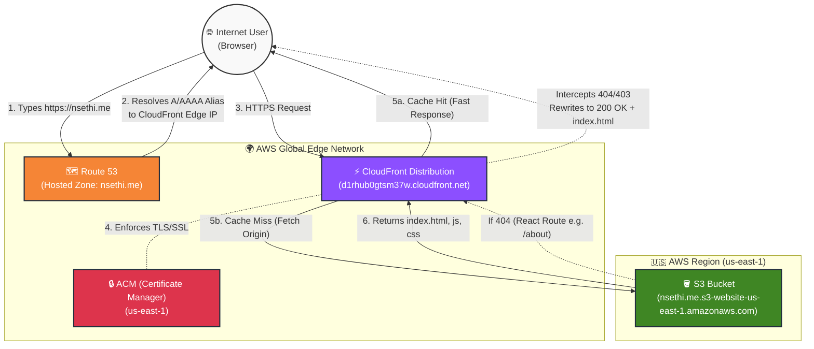

# AWS Migration Architecture

Below is the detailed architectural flow for the deployed `react-portfolio` on AWS. 

It highlights the full user request lifecycle: from DNS resolution with Route 53, through the globally distributed CloudFront Edge network with SSL termination, down to the scalable S3 storage backend with Single-Page Application (SPA) error handling.

### Flow Breakdown

1. **Route 53 (DNS):** A user types `nsethi.me` or `www.nsethi.me`. Route 53 uses an `Alias (A / AAAA)` record to smoothly route the user to the nearest CloudFront Edge location.
2. **CloudFront (CDN):** CloudFront receives the request.
   - It references **AWS Certificate Manager (ACM)** to securely terminate the SSL connection (`HTTPS`).
   - Any raw `HTTP` requests are forcefully given a `301 Redirect` back to `HTTPS`.
3. **Amazon S3 (Origin):** If CloudFront does not have the asset cached natively, it executes a fetch to the S3 Bucket configured for Static Website Hosting.
4. **SPA Fallback (React Router):** Because React relies on client-side routing, directly visiting a link like `/about` natively throws a `404 Not Found` in S3. CloudFront's **Custom Error Responses** catch these `403` and `404` errors, mutating them into a `200 OK`, and returning the root `index.html` file so React can render the page correctly!
